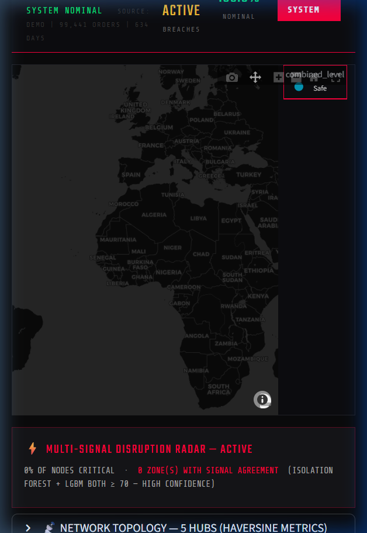

# SupChainMate — Autonomous Supply Chain Decision System

> **Beyond dashboards. Beyond visualisation. A multi-signal AI engine that detects risk, calculates decisions, and generates execution-ready outputs.**

[](https://python.org)
[](https://streamlit.io)
[](https://lightgbm.readthedocs.io)
[](https://facebook.github.io/prophet/)
[](https://groq.com)
[](https://build.nvidia.com)
[](LICENSE)

---

## 🖥️ Dashboard Preview



*Mission Control HUD — Multi-signal disruption radar, Groq AI auto-insights, and decision engine active*

---

## 🎯 What Is This?

SupChainMate is **not a reporting tool**. It is an autonomous decision layer that sits on top of your supply chain data and:

1. **Detects disruptions** before they cascade (Isolation Forest + LightGBM combined signal)
2. **Calculates optimal inventory decisions** (Safety Stock, EOQ, Reorder Point — domain math)
3. **Reasons over your data in real-time** (Groq LLaMA-3.3-70B copilot + auto-insights on load)
4. **Optimises routes** with NVIDIA cuOpt (real Capacitated VRP solver)
5. **Generates execution-ready outputs** (CSV exports consumable by Power BI, Excel, ERP)

```
Your Data (CSV / Excel)
        ↓
AI Analysis Layer
  ├── Demand Sensing     (Prophet + External Regressors)
  ├── Disruption Radar   (Isolation Forest × LightGBM fusion)
  ├── Decision Engine    (Safety Stock, EOQ, ROP, LT Buffer)
  ├── Groq AI            (Auto-Insights + Live Copilot + Executive Narrative)
  └── NVIDIA cuOpt       (Real VRP Route Optimisation)
        ↓
Prescriptive Actions + Execution Plan
        ↓
Export → Power BI / Excel / ERP
```

---

## 🏗️ Architecture

```
logistics-ai-dashboard/
├── app.py                        # Main Streamlit application
├── style.css                     # Mission Control HUD theme (cyberpunk-dark)
├── requirements.txt              # All 11 dependencies
├── .env                          # API keys (gitignored — never committed)
├── modules/
│   ├── forecast.py               # Prophet demand forecasting + external regressors
│   ├── network.py                # Geolocation, KMeans, Isolation Forest,
│   │                             #   Haversine metrics, combined_risk_signal()
│   ├── tracking.py               # LightGBM delay prediction + feature engineering
│   ├── decisions.py              # Supply Chain Decision Engine (SS, EOQ, ROP)
│   ├── ingestion.py              # Auto-detect CSV/Excel column mapping
│   ├── groq_ai.py                # Groq: copilot, auto-insights, executive narrative,
│   │                             #   smart column detection (LLaMA-3.3-70B)
│   ├── nvidia_api.py             # NVIDIA: cuOpt VRP optimisation, LLaMA-4 fallback
│   └── optimization.py           # Network KPI summary
└── data/
    └── olist_*.csv               # Auto-downloaded demo data (99k orders)
```

---

## 🤖 AI / ML Pipeline

### 1. Groq AI Layer — LLaMA-3.3-70B (v4.0)

| Feature | What It Does |
|---|---|
| **Auto-Insights** | 3 AI insights surfaced on every load — severity-ranked (HIGH/MEDIUM/LOW), metric-specific |
| **Live Copilot** | Context-aware Q&A with 13 live metrics injected per query (<1s response time) |
| **Executive Narrative** | AI writes the board-ready executive summary paragraph |
| **Smart Column Detection** | LLM maps non-standard CSV columns to internal schema — handles any naming convention |

### 2. NVIDIA cuOpt — Real Route Optimisation

| Property | Detail |
|---|---|
| Model | NVIDIA cuOpt via NIM API |
| Input | Haversine distance matrix from KMeans cluster centroids |
| Fleet | Auto-scaled to `n_clusters / 2` vehicles |
| Output | Optimised route km, savings vs naive sequential, per-vehicle breakdown |
| Fallback | Local greedy estimate if API unavailable (honest labelling) |

### 3. Disruption Radar — Multi-Signal Fusion

Two independent ML models fused into a single `combined_risk` score:

| Signal | Model | What It Detects |
|---|---|---|
| **Spatial Anomaly** | `IsolationForest` (sklearn) | Geographically isolated delivery nodes — thin coverage = higher risk |
| **Delay Probability** | `LGBMClassifier` (LightGBM) | Likelihood of delivery delay from 7 engineered features |
| **Combined Signal** | Weighted fusion (50/50) | High-confidence when both signals simultaneously agree (≥70 each) |

```
combined_risk = 0.5 × IF_score + 0.5 × LGBM_delay_proba

combined_risk ≥ 85  →  ⚡ CRITICAL  (signal agreement — high confidence)
combined_risk ≥ 65  →  ⚠  WARNING
else                →  ✅ SAFE
```

### 4. LightGBM Delay Prediction — 7 Engineered Features

| Feature | Type | Rationale |
|---|---|---|
| `hour`, `day_of_week`, `month` | Calendar | Time-of-day/week delivery patterns |
| `is_weekend`, `is_month_end` | Binary flag | High-risk operational periods |
| `lead_days`, `lead_days_sq` | Continuous | Primary delay driver (non-linear signal) |
| `long_lead` | Binary flag | Orders with >14 day lead times |

### 5. Supply Chain Decision Engine — Domain Mathematics

| Formula | Implementation |
|---|---|
| Safety Stock | `SS = Z × √(μ_LT × σ_d² + μ_d² × σ_LT²)` — combined variance formula |
| EOQ | `Q* = √(2DS/H)` — minimises total annual inventory cost |
| Reorder Point | `ROP = μ_d × μ_LT + SS` |
| Lead Time Buffer | `LTB = Z × σ_LT` |
| Annual Savings | `Cost(current) − Cost(EOQ-based)` |

---

## 📊 Features

### Upload Flow
- Upload **CSV or Excel** for Orders, Delivery, Location, or Cost data
- **Auto-detect column names** — regex engine + Groq LLM fallback for ambiguous columns
- **Try Demo Data** — instant load of 99k real Brazilian e-commerce orders

### Mission Control Dashboard
- Real-time system status bar (breach count, nominal %, override button)
- **Groq Auto-Insights** — 3 AI-generated insights on every dashboard load, severity-coloured
- **Disruption Radar** — carto-darkmatter Mapbox coloured by combined ML risk signal
- **Zone Risk Alerts** — per-cluster consulting-grade narratives with decomposed signal breakdown
- **Decision Engine HUD** — Safety Stock, EOQ, ROP, Annual Savings — dynamically recalculated

### AI Copilot
- **Groq LLaMA-3.3-70B** — primary copilot, sub-second inference
- **13 live metrics** injected into every system prompt (delay risk, EOQ, breaches, etc.)
- **NVIDIA LLaMA-4-Scout** — automatic fallback if Groq unavailable
- Shows 🟢 LIVE / 🟡 OFFLINE status indicator

### Route Optimisation
- **NVIDIA cuOpt** — real Capacitated Vehicle Routing Problem solver
- Haversine distance matrix built from delivery cluster centroids
- Shows total route km, naive baseline, and % distance savings

### Enterprise Reporting Layer
| Export | Contents | Format |
|---|---|---|
| Forecast Data | Date, yhat, lower/upper bounds | CSV (Power BI ready) |
| KPI Summary | All 12 headline metrics | CSV |
| Inventory Plan | All Decision Engine parameters | CSV |
| Zone Risk Table | Per-cluster scores + recommended actions | CSV |
| Execution Plan | Ranked actions with owners + target dates | CSV |
| Executive Report | Full intelligence brief | CSV |

---

## 🚀 Getting Started

### Installation
```bash
git clone https://github.com/Kisharky/SupChainMate.git
cd SupChainMate/logistics-ai-dashboard
pip install -r requirements.txt
```

### API Keys (Optional — all features degrade gracefully without them)
Create `logistics-ai-dashboard/.env`:
```env
GROQ_API_KEY=your_groq_key_here
NVIDIA_CUOPT_API_KEY=your_nvidia_cuopt_key_here
NVIDIA_LLAMA_API_KEY=your_nvidia_llama_key_here
```

### Run
```bash
streamlit run app.py
# or on Windows
python -m streamlit run app.py
```
Open http://localhost:8501

---

## 📦 Data Requirements

Upload any CSV or Excel. The auto-detection engine handles any naming convention:

| Data Type | Required | Key Columns Auto-Detected |
|---|---|---|
| **Orders** | ✅ Required | date/timestamp, quantity/volume |
| **Delivery** | Optional | delivery date, status, lead time |
| **Location** | Optional | lat/lon or zip/postal code |
| **Cost** | Optional | cost/price/fee columns |

**Demo Data**: [Olist Brazilian E-Commerce Dataset](https://www.kaggle.com/datasets/olistbr/brazilian-ecommerce) — 99k orders, real geolocation.

---

## 🔄 Changelog

### v4.0.0 — Groq AI + NVIDIA API Integration
- **NEW**: `modules/groq_ai.py` — 4 Groq-powered features (LLaMA-3.3-70B)
- **NEW**: Auto-Insights — 3 severity-ranked AI insights generated fresh on every load
- **NEW**: Groq Supply Chain Copilot with 13 live metrics in context (<1s response)
- **NEW**: Smart column detection via Groq LLM (handles non-standard CSV naming)
- **NEW**: `modules/nvidia_api.py` — NVIDIA cuOpt VRP solver + LLaMA-4-Scout fallback
- **NEW**: cuOpt "Execute Optimization" — real Haversine matrix, fleet routing, km savings
- **UPGRADE**: Copilot shows 🟢 LIVE / 🟡 OFFLINE status with automatic fallback chain
- **NEW**: `.env` support for API keys (gitignored, never committed)
- **NEW**: `docs/dashboard_preview.png` — screenshot in README

### v3.0.0 — Enterprise Intelligence Layer
- **NEW**: 6 structured CSV exports (Power BI / Excel ready)
- **NEW**: Executive Report auto-generation
- **NEW**: Zone Risk Intelligence Table + Inventory Decision Table

### v2.5.0 — Multi-Signal Risk Engine
- **NEW**: `combined_risk_signal()` — Isolation Forest × LightGBM fusion
- **NEW**: Signal agreement detection + per-zone consulting alerts
- **UPGRADE**: Map coloured by `combined_level` (not random scores)

### v2.4.0 — ML Model Upgrades
- **UPGRADE**: LightGBM replaces RandomForest, 7 engineered features
- **UPGRADE**: `IsolationForest.decision_function()` normalised to 0–100
- **NEW**: Graceful model fallbacks throughout

### v2.3.0 — Supply Chain Decision Engine
- **NEW**: Safety Stock (combined variance formula), EOQ, ROP, Lead Time Buffer
- **NEW**: Service level Z-score table (80–99.9%), sidebar parameter controls

### v2.2.0 — Geolocation & Network Intelligence
- **UPGRADE**: Real Olist geolocation join, Haversine centroid metrics, n_clusters slider

### v2.1.0 — User Upload Flow
- **NEW**: CSV/Excel uploader with auto column detection (`modules/ingestion.py`)

### v2.0.0 — Mission Control HUD
- **REDESIGN**: Single-page dark HUD, carto-darkmatter map, system status bar

### v1.0.0 — Initial Dashboard
- Prophet, KMeans, RandomForest — basic Streamlit tab layout

---

## 🧠 Design Philosophy

> **"While tools like Power BI focus on visualisation, SupChainMate acts as a decision intelligence layer — generating prescriptive actions from multi-signal AI and exporting execution-ready plans directly into enterprise workflows."**

| Dimension | Power BI | SupChainMate |
|---|---|---|
| Purpose | Visualisation | Decision-making |
| Output | Charts | Execution plans + CSV exports |
| AI / ML | None | Groq LLaMA-3.3 + LightGBM + Prophet + Isolation Forest |
| Route Optimisation | None | NVIDIA cuOpt (real VRP) |
| Integration | Data in | Data in + decisions out → Power BI / ERP |

---

## 📄 License

MIT © Ishai — SupChainMate
