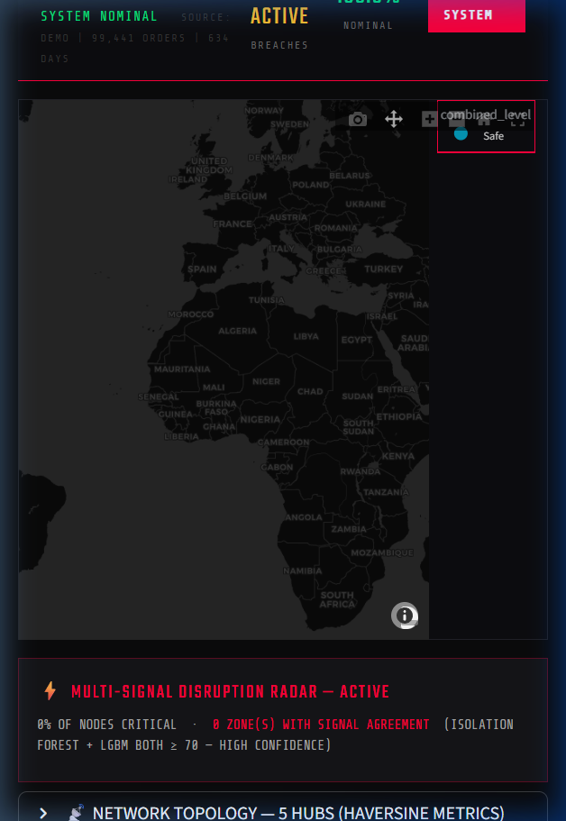
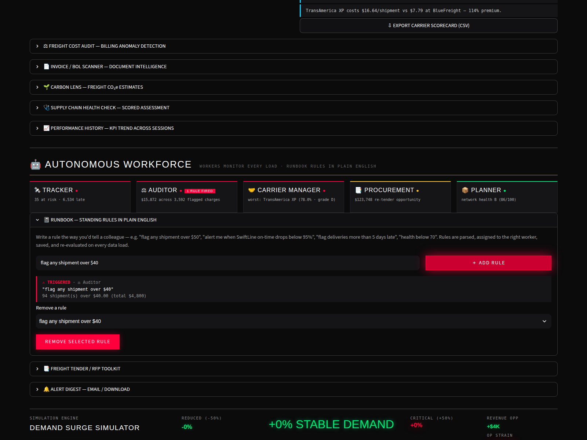
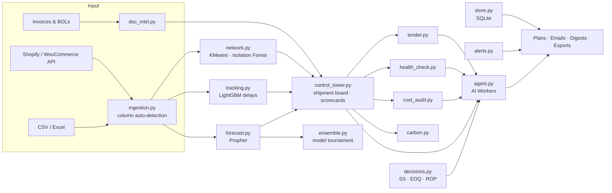

<div align="center">

# SupChainMate

**Autonomous Supply Chain Decision System**

*A freight control tower, a team of agentic AI workers, and an inventory decision engine — turning raw order data into execution-ready plans.*

[](CHANGELOG.md)
[](https://python.org)
[](https://streamlit.io)
[](https://lightgbm.readthedocs.io)
[](https://facebook.github.io/prophet/)
[](https://groq.com)
[](https://build.nvidia.com)
[](logistics-ai-dashboard/tests)
[](#license)

[Overview](#overview) · [Capabilities](#capabilities) · [AI Workers](#ai-workers) · [Architecture](#architecture) · [Getting Started](#getting-started) · [Configuration](#configuration) · [Testing](#testing) · [Roadmap](#roadmap)

</div>

---

## Dashboard



*Mission Control — multi-signal disruption radar, AI auto-insights, and the decision engine on 99k live orders.*



*The Autonomous Workforce — five AI workers reporting live status on every load, with plain-English runbook rules.*

---

## Overview

SupChainMate is not a reporting tool. It is an autonomous decision layer that ingests raw supply chain data and produces **decisions, documents, and alerts** — not charts. Every number in the product is computed from the data; AI models add reasoning, routing, and wording, never the figures.

The platform serves two audiences through one decision engine:

| Mode | Audience | Input |
|------|----------|-------|
| **Enterprise** | Supply chain teams with data | CSV/Excel uploads, Shopify/WooCommerce API sync, or the built-in demo (99k real orders) |
| **Small Retailer** | Shops without spreadsheets | A five-question form per product — no files required |

```
Orders / Delivery / Location / Cost  ──►  Intelligence Layer  ──►  Actions
  CSV · Excel · Shopify · WooCommerce      Forecasting (Prophet + ensemble)      Reorder & execution plans
  Invoices & BOLs (PDF)                    Disruption radar (IF × LightGBM)      Carrier SLA emails
                                           Decision engine (SS · EOQ · ROP)      Tender / RFP packs
                                           Freight cost audit                    Alert digests (email)
                                           AI Workers (Groq tool-calling)        CSV exports → Power BI / ERP
```

### Design principles

1. **Decisions over dashboards** — every panel ends in an action, a document, or an export.
2. **Numbers from data, words from AI** — LLMs route requests and write prose; all figures come from deterministic computation.
3. **Graceful degradation** — every feature works with zero API keys; keys add LLM reasoning, not correctness.
4. **Honest labelling** — simulated demo elements (carrier names, costs, transport modes) are labelled as such in the UI.

---

## Capabilities

### Freight Operations

| Capability | Description |
|---|---|
| **Freight Control Tower** | Every shipment classified (ON TRACK / AT RISK / LATE / DELIVERED LATE / CANCELLED) with real on-time performance vs promised dates, exceptions-first sorting, and CSV export |
| **Carrier Scorecards** | Per-carrier volume, on-time %, average delay, cost per shipment, A–D grades, and plain-language volume-shift / SLA-review insights |
| **Freight Cost Audit** | Billing anomaly detection: per-carrier IQR cost outliers with overcharge estimates, potential duplicate charges, late-delivery premiums, and re-tender opportunity |
| **Invoice / BOL Scanner** | Upload a freight invoice (PDF/TXT); fields are extracted and reconciled against the shipment board and audited rate bands, producing pay/review verdicts |
| **Tender / RFP Toolkit** | Data-backed tender pack: monthly lane volumes, peak-capacity callout, incumbent carrier summary, ready-to-edit RFP document, and a carrier rate-shift simulator |
| **Carbon Lens** | CO₂e estimates from real route distances (DEFRA-style mode factors) by carrier and zone, greenest-vs-cheapest analysis, route-savings in tCO₂e |

### Planning & Intelligence

| Capability | Description |
|---|---|
| **Decision Engine** | Safety stock (combined variance formula), EOQ, reorder point, lead-time buffer, and annual savings — reference inventory mathematics (Nahmias) |
| **SKU Intelligence** | Per-product decisions for the whole catalogue: ABC classification (revenue Pareto), differentiated service levels by class, per-SKU safety stock / ROP / EOQ, editable stock levels with ORDER NOW / SOON / OK status, per-SKU reorder plan export |
| **Demand Forecasting** | Prophet with external regressors, plus a **model tournament**: LightGBM / Random Forest / Gradient Boosting / Ridge and their ensemble, backtested against Prophet on a 28-day holdout with the champion crowned by MAPE |
| **Market Signals** | External factor engine: keyless FX (frankfurter/ECB), Brent crude (Stooq), weather (Open-Meteo), offline holiday calendar, and PostHog/GA daily-events imports — with a terminal-style ticker, factor↔demand correlations (incl. 7-day leading), and factor uplift **proven on the forecast holdout** |
| **Disruption Radar** | Isolation Forest spatial anomalies fused 50/50 with LightGBM delay probabilities into a single risk signal with signal-agreement zone alerts |
| **Route Optimisation** | NVIDIA cuOpt capacitated VRP over a Haversine distance matrix from KMeans cluster centroids, with an honest local fallback |
| **Health Check** | Scored assessment (0–100, A–F) across delivery, risk, cost, inventory, network, and data-quality dimensions, with DIFOT and priority actions |
| **What-If Lab** | Demand / lead-time / variability / service-level sliders with live decision-engine recalculation and deltas vs baseline |
| **Performance History** | One KPI snapshot per data load (SQLite); health score and on-time % trends across sessions |

### Delivery & Integration

| Capability | Description |
|---|---|
| **Live Store Connect** | Order sync from Shopify (Admin API) and WooCommerce (REST v3); credentials are used per-fetch and never persisted |
| **Smart Ingestion** | Column auto-detection (regex + optional LLM) for any CSV/Excel naming convention; Shopify/WooCommerce export recognition |
| **Autonomous Runbook** | Standing rules in plain English, parsed deterministically, auto-assigned to the right AI Worker, persisted, and enforced on every data load — triggered rules lead the alert digest |
| **Alert Digests** | Enterprise (runbook + exceptions + audit + health) and retail (per-product reorder) digests, delivered by SMTP email or download |
| **Reporting Layer** | Six structured CSV exports — forecast, KPI summary, inventory plan, zone risk, execution plan, executive report — ready for Power BI, Excel, or ERP import |
| **Persistence** | SQLite-backed retail tracker, settings, and KPI history that survive restarts |

---

## Decision Center — the trust layer

Every material AI recommendation flows through a human-in-the-loop **Decision Center** before it counts:

- **Explainable** — each recommendation carries WHY drivers, every one backed by an evidence value from the data (demand σ, days of cover, on-time gaps, the formula used)
- **Confidence with a stated basis** — a transparent heuristic (data support + signal strength, 20–95). The basis string says exactly what it's built from; it is deliberately *not* presented as a calibrated probability
- **Quantified business impact** — cost savings ($/yr), stockout risk (%), and service level (%) chips on every card, computed by the same deterministic engines
- **Approve / Reject / Modify** — modifications carry a note; decisions are stamped with actor and UTC time
- **Decision history + immutable audit trail** — every creation and decision event is logged to SQLite and exportable as CSV

This adapts the design patterns common across enterprise control towers (action centers, explanation drill-downs, approval workflows, audit trails) into an open implementation — patterns, not proprietary features.

---

## AI Workers

The agentic copilot organises its **10 tools** as five named workers — each with a defined remit, one-click actions, and reply attribution:

| Worker | Remit | Tools |
|---|---|---|
| 🛰 **Tracker** | Track & Trace | `get_at_risk_shipments` · `exception_summary` |
| ⚖ **Auditor** | Invoicing & Audit | `freight_cost_audit` |
| 🤝 **Carrier Manager** | Carrier Vetting | `get_carrier_scorecard` · `draft_carrier_email` |
| 📑 **Procurement** | Quoting & Tenders | `generate_tender_pack` |
| 📦 **Planner** | Inventory Planning | `generate_reorder_plan` · `supply_chain_health_check` |

**Autonomous operation**

- **Workforce Status Board** — every data load triggers a background sweep; each worker reports live status (at-risk counts, flagged spend, worst carrier, re-tender opportunity, network health) with green/yellow/red indicators.
- **Runbook** — standing rules in plain English (*"flag any shipment over $50"*, *"alert me when SwiftLine on-time drops below 95%"*, *"health below 70"*). Rules are parsed deterministically, auto-assigned to the right worker, persisted in SQLite, re-evaluated on every load, and included in the alert digest.

**How it works**

- **Groq LLaMA-3.3-70B function calling** routes requests, chains tools (up to 4 turns), and composes replies citing tool results.
- **Offline mode**: with no API key, a deterministic router still executes every action on live data — the LLM adds reasoning and wording, never the numbers.
- **Reasoning trace**: every turn records its chain — routing decision, LLM turns, tool calls with arguments, per-step timings — rendered as an expandable step list.
- **Artifacts**: workers return downloadable deliverables (CSV tables, email drafts, digests, RFP documents).

---

## Architecture


```mermaid
flowchart LR
    subgraph Input
        A[CSV / Excel] --> I
        B[Shopify / WooCommerce API] --> I
        C[Invoices & BOLs] --> DI
    end
    I[ingestion.py<br/>column auto-detection] --> F[forecast.py<br/>Prophet]
    I --> T[tracking.py<br/>LightGBM delays]
    I --> N[network.py<br/>KMeans · Isolation Forest]
    F & T & N --> CT[control_tower.py<br/>shipment board · scorecards]
    CT --> CA[cost_audit.py]
    CT --> HC[health_check.py]
    CT --> TE[tender.py]
    CT --> CB[carbon.py]
    DI[doc_intel.py] --> CT
    F --> EN[ensemble.py<br/>model tournament]
    D[decisions.py<br/>SS · EOQ · ROP] --> AG
    CT & CA & HC & TE --> AG[agent.py<br/>AI Workers]
    AG --> OUT[Plans · Emails · Digests · Exports]
    AL[alerts.py] & ST[store.py<br/>SQLite] --> OUT
```

### Repository layout

```
SupChainMate/
├── docs/
│   ├── index.html                # Marketing landing page (GitHub Pages ready)
│   └── dashboard_preview.png
├── logistics-ai-dashboard/
│   ├── app.py                    # Streamlit entry point (dashboard orchestration)
│   ├── config.py                 # Paths, env lookup, model IDs, thresholds, logging
│   ├── style.css                 # HUD theme
│   ├── requirements.txt          # Pinned dependency versions
│   ├── .env.example              # API key & SMTP template
│   ├── views/
│   │   ├── helpers.py            # Theme injection, chat render helpers
│   │   ├── landing.py            # Mode-select launch screen
│   │   ├── retail.py             # Small Retailer page
│   │   ├── upload.py             # Enterprise upload screen + store connect
│   │   ├── pipeline.py           # Demo loading & upload processing
│   │   └── decision_center.py    # Human-in-the-loop approval workflow + audit
│   ├── modules/
│   │   ├── ingestion.py          # Column auto-detection, store-export recognition
│   │   ├── forecast.py           # Prophet + external regressors
│   │   ├── ensemble.py           # Model tournament (LightGBM/RF/GBM/Ridge vs Prophet)
│   │   ├── factors.py            # External factor engine (FX, oil, weather, holidays, analytics)
│   │   ├── tracking.py           # LightGBM delay model, feature engineering
│   │   ├── network.py            # Geolocation, KMeans, Isolation Forest, risk fusion
│   │   ├── decisions.py          # Decision engine (SS, EOQ, ROP, savings)
│   │   ├── sku.py                # Per-SKU intelligence: ABC classes, per-product engine
│   │   ├── control_tower.py      # Shipment board, carrier scorecards, KPIs
│   │   ├── cost_audit.py         # Billing anomaly detection
│   │   ├── doc_intel.py          # Invoice/BOL extraction + reconciliation
│   │   ├── carbon.py             # CO2e estimates by carrier, zone, mode
│   │   ├── health_check.py       # Scored 6-dimension assessment, DIFOT
│   │   ├── tender.py             # Tender/RFP pack + rate-shift simulation
│   │   ├── agent.py              # AI Workers: tool-calling loop + offline router + sweep
│   │   ├── trust.py              # Decision trust layer: explainable, scored recommendations
│   │   ├── runbook.py            # Plain-English standing rules engine
│   │   ├── groq_ai.py            # Groq copilot, auto-insights, column detection
│   │   ├── nvidia_api.py         # cuOpt VRP solver, DeepSeek fallback
│   │   ├── connect.py            # Shopify / WooCommerce connectors
│   │   ├── alerts.py             # Digests + SMTP delivery
│   │   ├── store.py              # SQLite persistence (tracker, settings, KPI history)
│   │   ├── retail.py             # Small Retailer helpers
│   │   └── optimization.py       # Network KPI summary
│   ├── tests/
│   │   ├── test_core.py          # Decision engine, forecasting, optimisation, network
│   │   └── test_modules.py       # Feature-module suite
│   └── data/                     # Demo dataset (Olist, 99k orders) + SQLite DB
├── CHANGELOG.md
└── README.md
```

---

## Getting Started

### Prerequisites

- Python 3.10+
- pip

### Installation

```bash
git clone https://github.com/Kisharky/SupChainMate.git
cd SupChainMate/logistics-ai-dashboard
pip install -r requirements.txt
```

### Run

```bash
streamlit run app.py          # or: python -m streamlit run app.py
```

Open http://localhost:8501, choose **Enterprise** or **Small Retailer** mode, and either upload data, connect a store, or press **Try Demo Data**.

---

## Configuration

All configuration is optional — **every feature degrades gracefully without it**. Copy the template and fill in what you use:

```bash
cp .env.example .env
```

| Variable | Purpose | Without it |
|---|---|---|
| `GROQ_API_KEY` | LLM reasoning for the AI Workers, auto-insights, executive narrative, invoice parsing, smart column detection | Deterministic routing and regex extraction still run every action |
| `NVIDIA_CUOPT_API_KEY` | Real cuOpt VRP route optimisation | Local greedy estimate, labelled as such |
| `NVIDIA_DEEPSEEK_API_KEY` | Copilot fallback when Groq is unavailable | Offline copilot mode |
| `NVIDIA_LLAMA_API_KEY` | Legacy fallback model | — |
| `SMTP_HOST` / `SMTP_PORT` / `SMTP_USER` / `SMTP_PASS` / `SMTP_FROM` | Email delivery of alert digests | Digests remain downloadable in-app |

**Store connections** (Shopify Admin API token with `read_orders`; WooCommerce read-only REST keys) are entered in the UI per-fetch and never persisted.

---

## Data Requirements

Upload any CSV or Excel — the ingestion engine auto-detects columns under any naming convention:

| Data type | Required | Auto-detected fields |
|---|---|---|
| **Orders** | ✅ | date/timestamp, quantity, SKU · Shopify & WooCommerce exports recognised |
| **Delivery** | Optional | delivery date, promised/ETA date, status, lead time, **carrier**, **freight cost**, transport mode |
| **Location** | Optional | lat/lon or postal code |
| **Cost** | Optional | cost / price / fee columns |

**Demo dataset**: [Olist Brazilian E-Commerce](https://www.kaggle.com/datasets/olistbr/brazilian-ecommerce) — 99,441 real orders with genuine promised-vs-actual delivery dates. Demo carrier names, freight costs, and transport modes are simulated and labelled in the UI.

---

## Testing

```bash
cd logistics-ai-dashboard
python -m pytest tests/ -q        # 73 tests
```

Coverage spans the decision-engine mathematics (safety stock, EOQ, ROP, monotonicity), network scoring (Haversine, clustering, Isolation Forest), forecasting aggregation, optimisation summaries, shipment classification, carrier scorecards, cost-audit anomaly detection, health-check scoring, tender and rate-shift math, ensemble backtesting, alert digests, SQLite persistence, agent routing and tracing, and the store connectors (exercised against mocked HTTP — no network required).

---

## Deployment

- **Streamlit Cloud / self-hosted** — point the deployment at `logistics-ai-dashboard/app.py`; add secrets from the configuration table above. Note that SQLite persistence is per-instance on ephemeral hosts.
- **Marketing site** — `docs/index.html` is a self-contained landing page: enable GitHub Pages on the `docs/` folder to publish it.

---

## Roadmap

- Real carrier tracking API integrations
- OAuth-based store connections and hosted multi-tenant deployment
- Scheduled background runs (workers acting between sessions, not just on load)

See [CHANGELOG.md](CHANGELOG.md) for the full release history (v1.0 → v4.8).

---

## Positioning

> While BI tools visualise, SupChainMate **decides** — generating prescriptive actions from multi-signal AI and exporting execution-ready plans directly into enterprise workflows.

| Dimension | Typical BI | SupChainMate |
|---|---|---|
| Output | Charts | Decisions, documents, alerts, exports |
| AI / ML | — | Prophet · LightGBM · Isolation Forest · ensemble tournament · Groq LLaMA-3.3 agents |
| Freight ops | — | Control tower, scorecards, cost audit, invoice scanner, tender packs, CO₂e |
| Integration | Data in | Data in **and** decisions out → Power BI / Excel / ERP |

---

## License

MIT © [Kishan Nagesh](https://www.linkedin.com/in/kisharky-n-5147941a4) — Master of Business (Supply Chain & International Business), Monash University, Melbourne
