<!-- ░░░ HERO ░░░ -->
<div align="center">


<a href="#the-control-plane--reactnextjs-frontend">
  
</a>

<br/>

[](CHANGELOG.md)
[](#license)
[](logistics-ai-dashboard/tests)

[](https://nextjs.org)
[](https://react.dev)
[](https://www.typescriptlang.org)
[](https://tailwindcss.com)
[](https://fastapi.tiangolo.com)
[](https://python.org)
[](https://facebook.github.io/prophet/)
[](https://build.nvidia.com)
[](https://leafletjs.com)
[](#authentication--access-control)
[](#configuration)
[](#run-with-docker)
[](.github/workflows/ci.yml)

<br/>

**[Control Plane](#the-control-plane--reactnextjs-frontend)** · **[Decision Center](#decision-center--the-trust-layer)** · **[AI Architecture](#ai-architecture--provider-agnostic-capability-routed)** · **[Architecture](#architecture)** · **[Getting Started](#getting-started)** · **[Configuration](#configuration)**

<br/>

<!-- ░░░ ANIMATED DEMO ░░░ -->
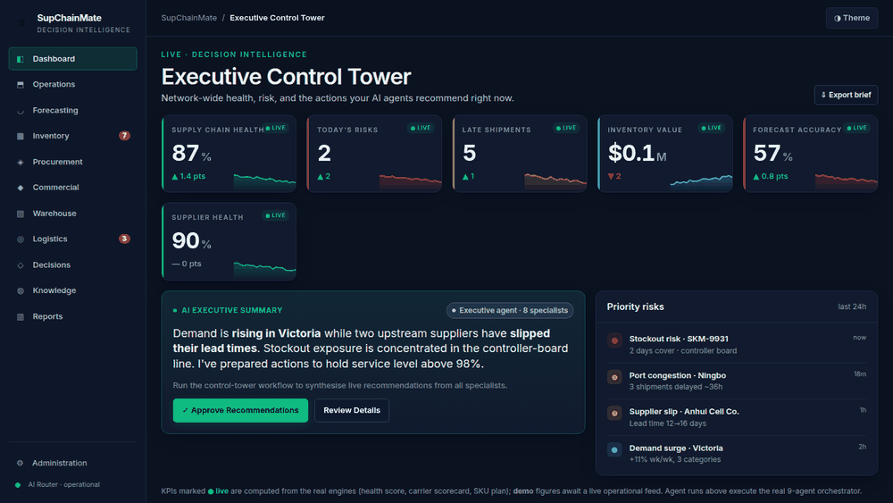

<sub><i>Live walkthrough — Executive Control Tower → Decision Center → Commercial Intelligence → Logistics → Forecasting → Inventory.</i></sub>

<br/><br/>

<sub><b><a href="docs/DEMO.md">▶ Guided demo walkthrough</a></b> &nbsp;·&nbsp; <b><a href="docs/AUDIT.md">Enterprise readiness audit</a></b></sub>

</div>

---

## Screens

<table>
  <tr>
    <td width="50%">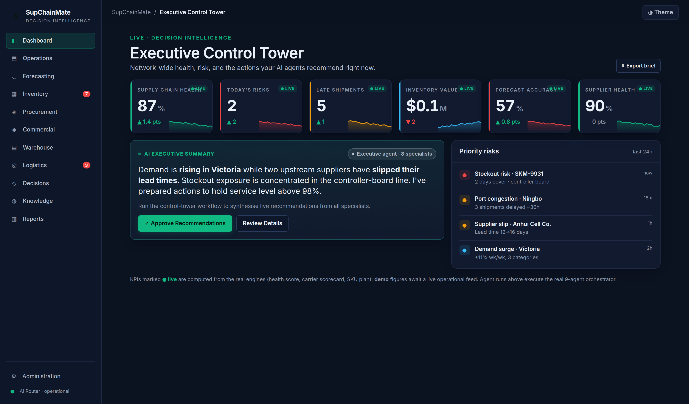<br/><sub><b>Executive Control Tower</b> — KPIs, AI Executive Summary, live 9-agent run.</sub></td>
    <td width="50%">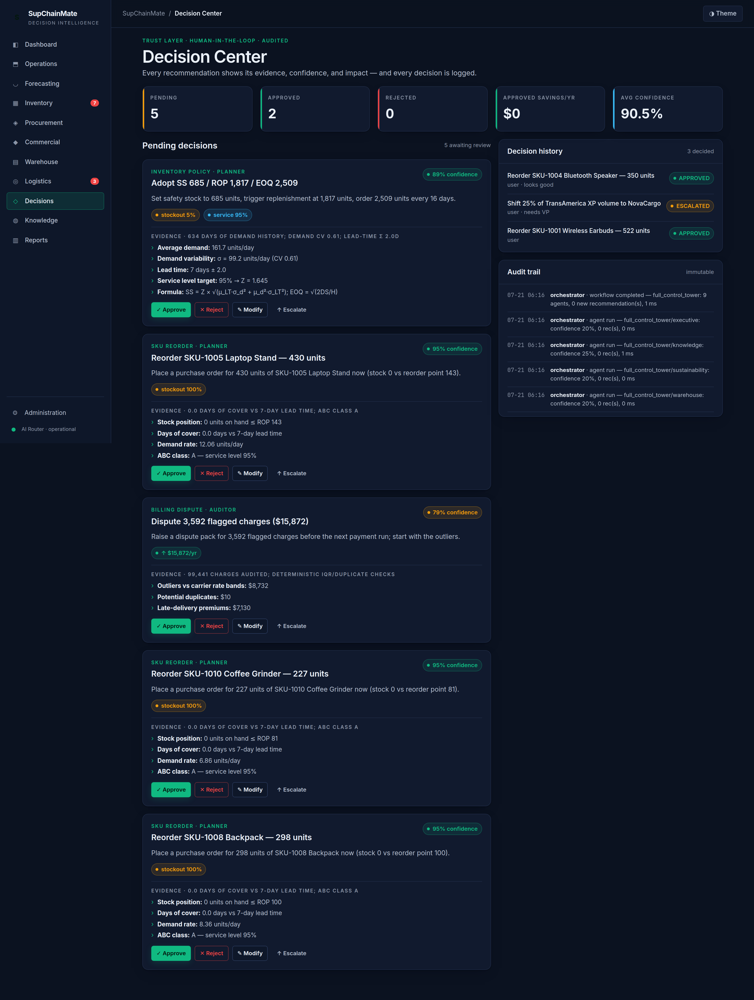<br/><sub><b>Decision Center</b> — evidence, confidence, impact · approve / reject / modify / escalate · audit trail.</sub></td>
  </tr>
  <tr>
    <td>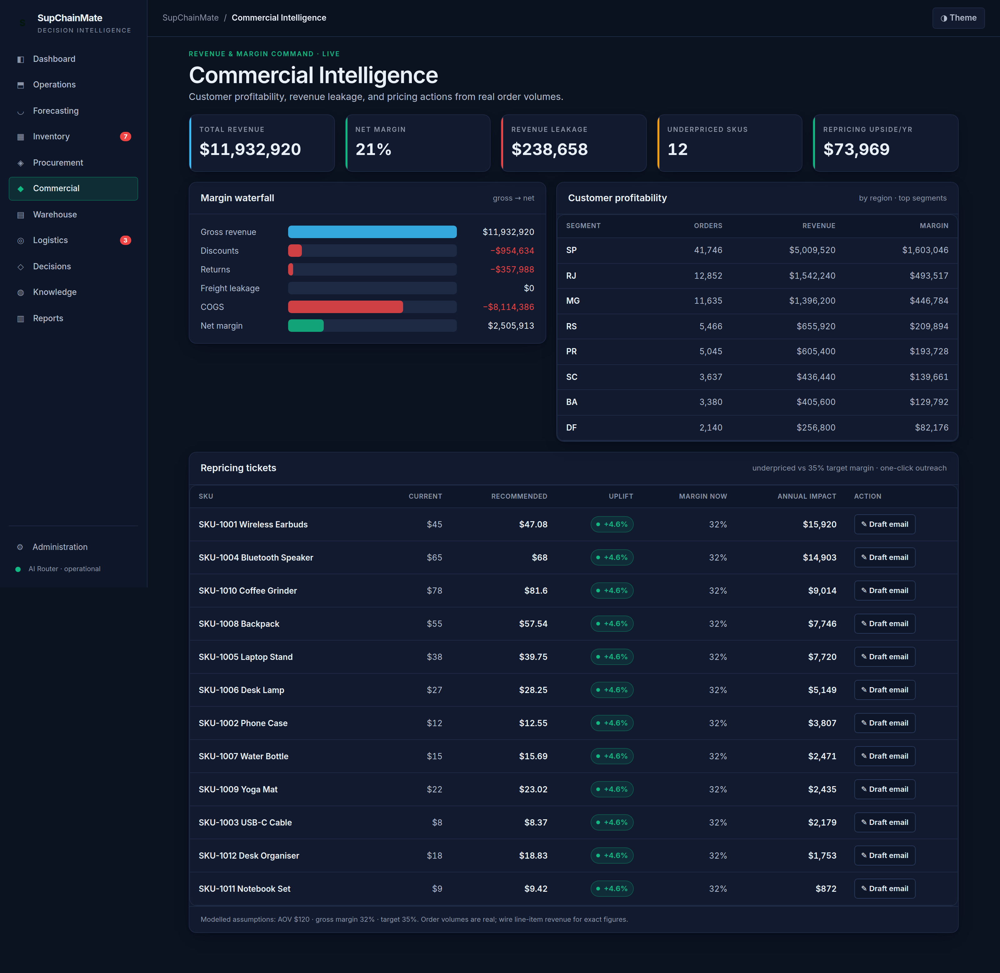<br/><sub><b>Commercial Intelligence</b> — profitability, revenue leakage, margin waterfall, repricing tickets.</sub></td>
    <td>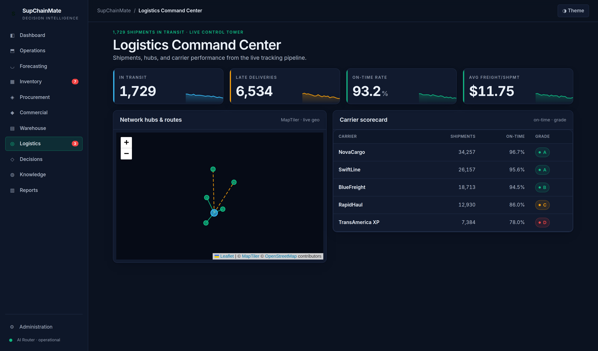<br/><sub><b>Logistics Command Center</b> — MapTiler network map + live carrier scorecard.</sub></td>
  </tr>
  <tr>
    <td>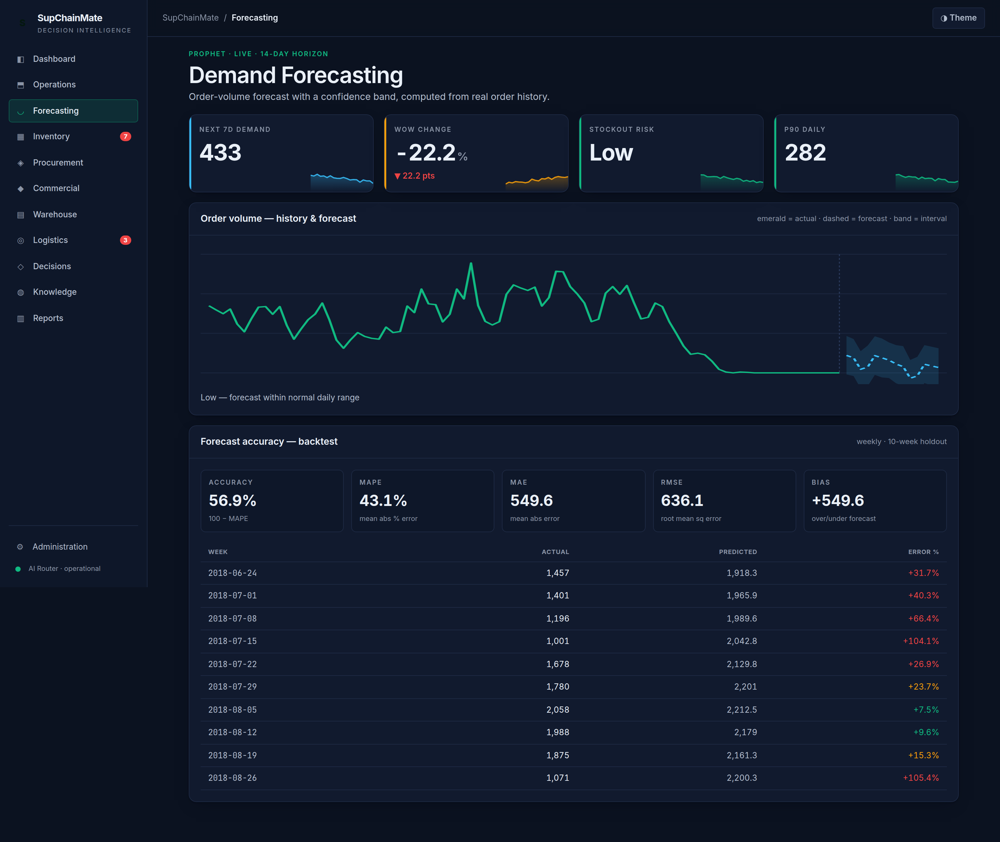<br/><sub><b>Forecasting</b> — Prophet forecast + weekly backtest (MAPE · MAE · RMSE · Bias).</sub></td>
    <td>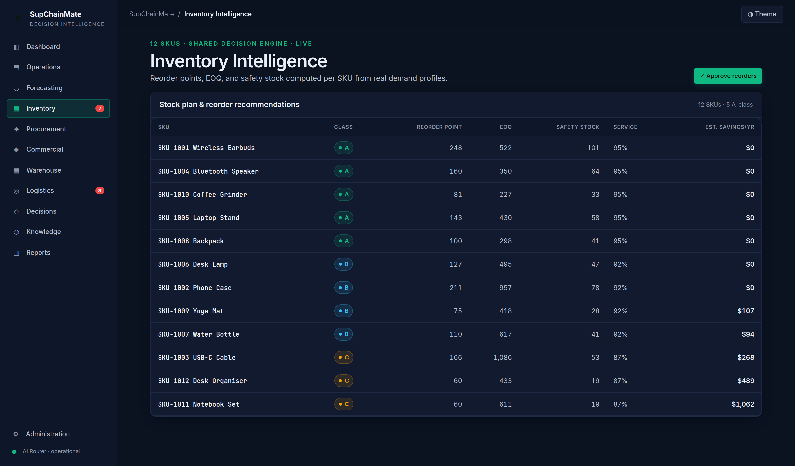<br/><sub><b>Inventory Intelligence</b> — live per-SKU reorder points, EOQ, safety stock.</sub></td>
  </tr>
  <tr>
    <td>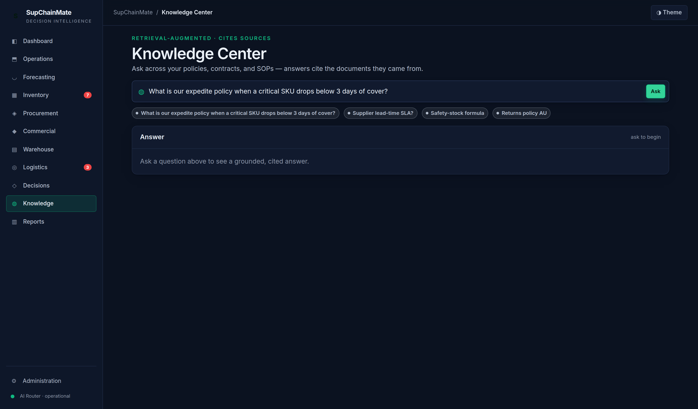<br/><sub><b>Knowledge Center</b> — RAG answers with inline citations.</sub></td>
    <td>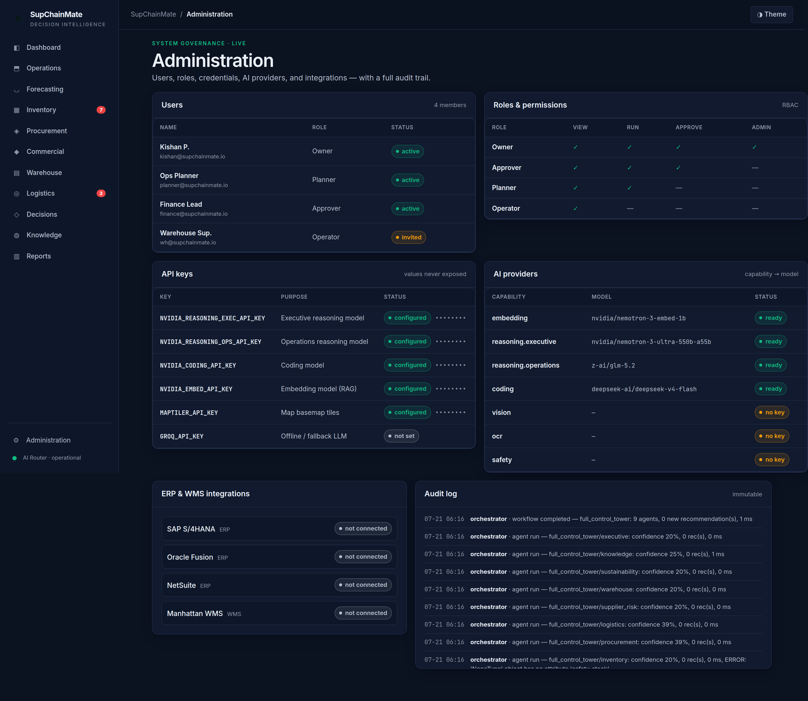<br/><sub><b>Administration</b> — providers, masked API keys, RBAC, immutable audit log, and Connectors (enterprise integrations).</sub></td>
  </tr>
</table>

---

## Enterprise architecture

A clean, layered system: a **Next.js** control plane over a **FastAPI** backend, an
**auth/RBAC** gate in front of the domain, and a set of framework-free intelligence
layers (AI Router, Optimization Router, Planner, Decision Brain) that the domain
services compose. Identity state lives in **PostgreSQL** (or SQLite for offline
demo); everything is containerised and CI-checked.

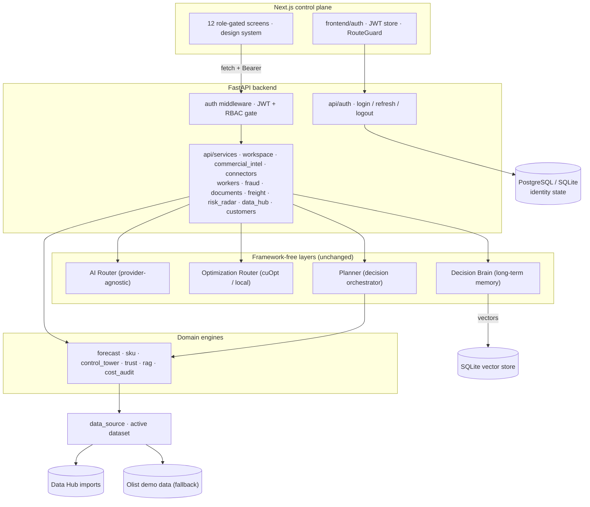
```mermaid
flowchart TB
    subgraph Client["Next.js control plane"]
        UI["12 role-gated screens · design system"]
        AUTHFE["frontend/auth · JWT store · RouteGuard"]
    end
    subgraph API["FastAPI backend"]
        GATE["auth middleware · JWT + RBAC gate"]
        AUTH["api/auth · login / refresh / logout"]
        SVC["api/services · workspace · commercial_intel · connectors<br/>workers · fraud · documents · freight · risk_radar · data_hub · customers"]
    end
    subgraph Intelligence["Framework-free layers (unchanged)"]
        AIR["AI Router (provider-agnostic)"]
        OPT["Optimization Router (cuOpt / local)"]
        PLN["Planner (decision orchestrator)"]
        BRN["Decision Brain (long-term memory)"]
    end
    subgraph Domain["Domain engines"]
        ENG["forecast · sku · control_tower · trust · rag · cost_audit"]
    end
    UI -->|"fetch + Bearer"| GATE
    AUTHFE --> AUTH
    GATE --> SVC --> ENG
    SVC --> AIR & OPT & PLN & BRN
    PLN --> ENG
    BRN -->|vectors| STORE[("SQLite vector store")]
    AUTH --> IDDB[("PostgreSQL / SQLite<br/>identity state")]
    ENG --> DS["data_source · active dataset"]
    DS --> HUB[("Data Hub imports")]
    DS --> DEMO[("Olist demo data (fallback)")]
```

### Tech stack

| Layer | Technology |
| --- | --- |
| Frontend | Next.js 14 (App Router), React 18, TypeScript, Tailwind, Leaflet |
| Backend | FastAPI, Uvicorn, Python 3.11 |
| Auth | JWT (HS256, rotating refresh), PBKDF2 password hashing, RBAC — stdlib crypto |
| Data / ORM | SQLAlchemy 2.0 · PostgreSQL (prod) / SQLite (offline) |
| AI | Provider-agnostic AI Router → NVIDIA NIM / any model · enterprise RAG |
| ML | Prophet, LightGBM, scikit-learn, Isolation Forest |
| Optimisation | NVIDIA cuOpt (GPU) with a local heuristic fallback |
| Infra | Docker + Docker Compose · GitHub Actions CI |

### Enterprise readiness

- **Authentication & RBAC** — JWT with rotating refresh tokens, six roles, a
  central path-based permission gate, role-filtered navigation.
- **Dual-database** — one env var (`DATABASE_URL`) switches identity state between
  PostgreSQL and SQLite; domain/demo data stays offline-friendly.
- **Containerised** — `docker compose up` launches Postgres + API + frontend.
- **CI** — every push runs backend tests, frontend lint, and a production build.
- **Config & secrets** — everything via environment (`.env.example` provided); no
  secrets in source.
- **Tested** — 165+ passing tests across the domain, AI layer, optimiser, Planner,
  Decision Brain, and auth/RBAC.

---

## Authentication & Access Control

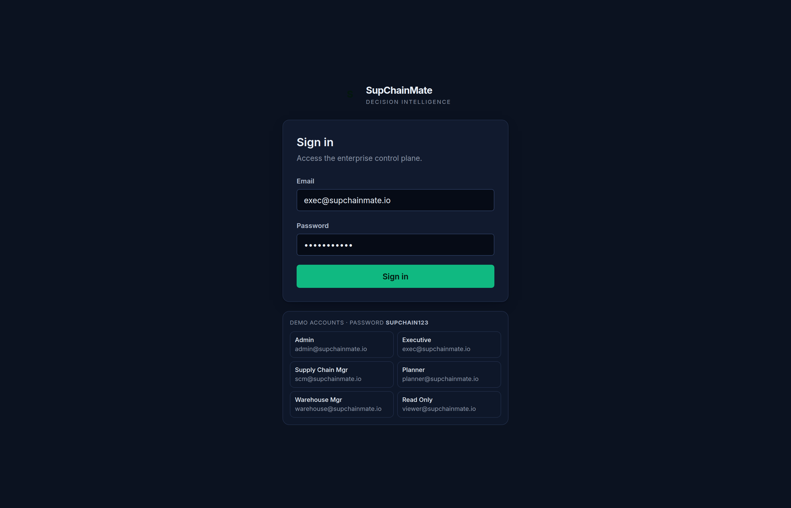

Authentication is **isolated** in `logistics-ai-dashboard/api/auth/` (backend) and
`frontend/auth/` (frontend) — no business logic changed. It is enforced once, in a
single FastAPI middleware keyed on the request path, so the domain routes are never
touched.

**Flow**

```
Login (email + password)
   └─▶ PBKDF2 verify ─▶ issue access JWT (30m) + refresh JWT (7d, server-recorded)
        └─▶ browser stores tokens ─▶ every API call sends `Authorization: Bearer <access>`
             └─▶ middleware verifies signature + expiry, resolves role → permissions,
                  enforces the path→permission map (RBAC)
        └─▶ on 401 the client rotates the refresh token once (single-use) and retries
        └─▶ logout revokes all refresh tokens
```

**Roles → visibility.** Six roles map to a permission set; navigation and endpoints
are gated on permissions (never on the role name). Executive-only areas
(Commercial, Intelligence, Reports) are invisible and `403` to a Warehouse Manager.

| Role | Sees |
| --- | --- |
| Admin | Everything, incl. Administration |
| Executive | Dashboard, Intelligence, Commercial, Decisions, Reports, + approve |
| Supply Chain Manager | Operations, Forecasting, Inventory, Procurement, Warehouse, Logistics, Decisions, Planner |
| Planner | Dashboard, Forecasting, Inventory, Planner, Decisions, Intelligence |
| Warehouse Manager | Dashboard, Warehouse, Inventory, Logistics, Knowledge |
| Read Only | View-only dashboards + reports (no approve) |

**API example**

```bash
# 1. Log in (demo password: supchain123)
curl -s localhost:8000/api/auth/login \
  -H 'Content-Type: application/json' \
  -d '{"email":"exec@supchainmate.io","password":"supchain123"}'
# → { "access_token": "...", "refresh_token": "...", "user": { "role": "Executive", "permissions": [...] } }

# 2. Call a protected endpoint with the token
curl -s localhost:8000/api/kpis -H "Authorization: Bearer $ACCESS_TOKEN"

# 3. Rotate the access token
curl -s localhost:8000/api/auth/refresh \
  -H 'Content-Type: application/json' -d '{"refresh_token":"'"$REFRESH_TOKEN"'"}'
```

Demo accounts (offline mode), all with password `supchain123`:
`admin@` · `exec@` · `scm@` · `planner@` · `warehouse@` · `viewer@supchainmate.io`.

---

## Run with Docker

One command launches the full stack — PostgreSQL, the FastAPI backend, and the
Next.js frontend:

```bash
cp logistics-ai-dashboard/.env.example logistics-ai-dashboard/.env   # optional: set JWT_SECRET, model keys
docker compose up --build
```

- Frontend → http://localhost:3000  ·  API → http://localhost:8000  ·  API docs → http://localhost:8000/docs
- Sign in with a demo account (see above). The backend seeds the six role users on
  first boot and auto-creates the identity schema.

---

## Overview

SupChainMate is not a reporting tool. It is an autonomous decision layer that ingests raw supply chain data and produces **decisions, documents, and alerts** — not charts. Every number in the product is computed from the data; AI models add reasoning, routing, and wording, never the figures.

The platform serves two audiences through one decision engine:

| Mode | Audience | Input |
|------|----------|-------|
| **Enterprise** | Supply chain teams with data | CSV/Excel uploads, Shopify/WooCommerce API sync, or the built-in demo (99k real orders) |
| **Small Retailer** | Shops without spreadsheets | A five-question form per product — no files required |

```
Orders / Delivery / Location / Cost  ──►  Intelligence Layer  ──►  Actions
  CSV · Excel · Shopify · WooCommerce      Forecasting (Prophet + ensemble)      Reorder & execution plans
  Invoices & BOLs (PDF)                    Disruption radar (IF × LightGBM)      Carrier SLA emails
                                           Decision engine (SS · EOQ · ROP)      Tender / RFP packs
                                           Freight cost audit                    Alert digests (email)
                                           AI Workers (Groq tool-calling)        CSV exports → Power BI / ERP
```

### Design principles

1. **Decisions over dashboards** — every panel ends in an action, a document, or an export.
2. **Numbers from data, words from AI** — LLMs route requests and write prose; all figures come from deterministic computation.
3. **Graceful degradation** — every feature works with zero API keys; keys add LLM reasoning, not correctness.
4. **Honest labelling** — simulated demo elements (carrier names, costs, transport modes) are labelled as such in the UI.

---

## The Control Plane — React / Next.js frontend

A production-grade **React / Next.js (App Router)** control plane sits on top of the existing engines through a thin **FastAPI** layer. The Python business logic and the Streamlit app are **untouched** — the API only imports the same `modules/` and `ai/` functions and exposes them as JSON.

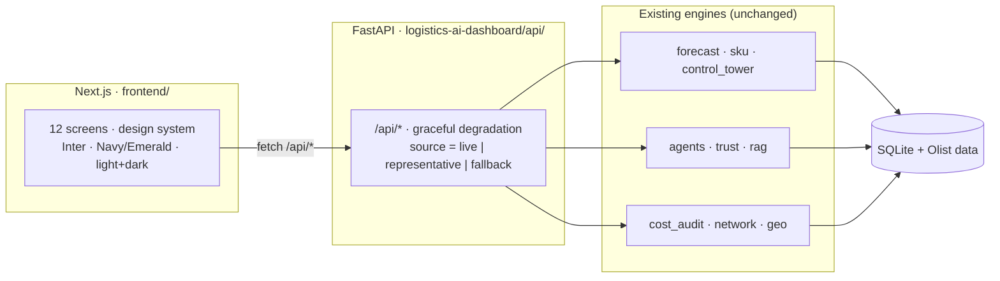
```mermaid
flowchart LR
    subgraph FE["Next.js · frontend/"]
        UI["12 screens · design system<br/>Inter · Navy/Emerald · light+dark"]
    end
    subgraph API["FastAPI · logistics-ai-dashboard/api/"]
        R["/api/* · graceful degradation<br/>source = live | representative | fallback"]
    end
    subgraph ENG["Existing engines (unchanged)"]
        E1["forecast · sku · control_tower"]
        E2["agents · trust · rag"]
        E3["cost_audit · network · geo"]
    end
    UI -- "fetch /api/*" --> R
    R --> E1 & E2 & E3
    E1 & E2 & E3 --> DB[("SQLite + Olist data")]
```

**Design system** — a single token set (Navy / Emerald / Slate / White, Inter + JetBrains Mono) drives every component; light and dark themes ship; the eight primitives (button, KPI card, table, chart, badge, nav, form, alert) compose all screens. Inspired by SAP Analytics Cloud, Microsoft Fabric, Palantir Foundry, and Linear. Reference: [`design/`](design/).

**Navigation** — `Dashboard · Operations · Forecasting · Inventory · Procurement · Commercial · Warehouse · Logistics · Decisions · Knowledge · Reports · Administration`. There is **no "AI" page** — AI is woven into every workflow.

| Screen | What it does | Data |
|---|---|---|
| **Executive Control Tower** | Six board KPIs + AI Executive Summary + live 9-agent run | 5/6 KPIs live · agents live |
| **Decision Center** | Approve / reject / modify / escalate with evidence, confidence, impact, audit trail | live |
| **Commercial Intelligence** | Customer profitability, revenue leakage, margin waterfall, repricing tickets, AI email drafting | live (real volumes) |
| **Logistics Command Center** | MapTiler network map + carrier scorecard + delay feed | live |
| **Forecasting** | Prophet forecast + weekly backtest — MAPE · MAE · RMSE · Bias | live |
| **Inventory Intelligence** | Per-SKU reorder point / EOQ / safety stock from the decision engine | live |
| **Knowledge Center** | RAG answers grounded in your documents, with citations | live |
| **Administration** | AI providers, masked API keys, RBAC, ERP stubs, audit log | live |

Each endpoint tags its payload `source = live | representative | fallback`, so the UI never breaks and always tells the truth about where a number came from. API keys are surfaced **presence-only and masked** — values are never returned.

### Run the control plane

```bash
# 1 — API (from logistics-ai-dashboard/)
pip install -r requirements.txt        # adds fastapi + uvicorn
uvicorn api.main:app --reload --port 8000

# 2 — Frontend (from frontend/)
npm install && npm run dev             # http://localhost:3000
```

`next.config.mjs` proxies `/api/*` to the API, so there's no CORS to configure in dev. Set `MAPTILER_API_KEY` in `.env` for the Logistics basemap. Full handoff notes in [`frontend/README.md`](frontend/README.md).

---

## Capabilities

### Freight Operations

| Capability | Description |
|---|---|
| **Freight Control Tower** | Every shipment classified (ON TRACK / AT RISK / LATE / DELIVERED LATE / CANCELLED) with real on-time performance vs promised dates, exceptions-first sorting, and CSV export |
| **Auto Carrier Allocation** | Multi-criteria volume allocation: carriers scored on cost, service, emissions, and reliability under your weights, with a concentration cap; blended cost/on-time/CO₂e impact vs the current mix; proposals route through the Decision Center |
| **Dispute Manager** | End-to-end billing-dispute lifecycle: raise disputes from audit-flagged charges, track OPEN → SENT → RESOLVED / WRITTEN_OFF, recovered dollars and recovery-rate KPIs, every transition audit-logged |
| **Carrier Scorecards** | Per-carrier volume, on-time %, average delay, cost per shipment, A–D grades, and plain-language volume-shift / SLA-review insights |
| **Freight Cost Audit** | Billing anomaly detection: per-carrier IQR cost outliers with overcharge estimates, potential duplicate charges, late-delivery premiums, and re-tender opportunity |
| **Invoice / BOL Scanner** | Upload a freight invoice (PDF/TXT); fields are extracted and reconciled against the shipment board and audited rate bands, producing pay/review verdicts |
| **Tender / RFP Toolkit** | Data-backed tender pack: monthly lane volumes, peak-capacity callout, incumbent carrier summary, ready-to-edit RFP document, and a carrier rate-shift simulator |
| **Geo Services** | Vendor-neutral geo stack: Leaflet radar map with MapTiler dark tiles (plotly fallback), Nominatim geocoding (keyless, cached), hub-to-hub road matrices via HERE (key) or the OSRM public server (keyless) with detour factors and drive times, and zone weather watch via OpenWeatherMap (key) or Open-Meteo (keyless) with delivery-risk notes |
| **Carbon Lens** | CO₂e estimates from real route distances (DEFRA-style mode factors) by carrier and zone, greenest-vs-cheapest analysis, route-savings in tCO₂e |

### Planning & Intelligence

| Capability | Description |
|---|---|
| **Decision Engine** | Safety stock (combined variance formula), EOQ, reorder point, lead-time buffer, and annual savings — reference inventory mathematics (Nahmias) |
| **SKU Intelligence** | Per-product decisions for the whole catalogue: ABC classification (revenue Pareto), differentiated service levels by class, per-SKU safety stock / ROP / EOQ, editable stock levels with ORDER NOW / SOON / OK status, per-SKU reorder plan export |
| **Demand Forecasting** | Prophet with external regressors, plus a **model tournament**: LightGBM / Random Forest / Gradient Boosting / Ridge and their ensemble, backtested against Prophet on a 28-day holdout with the champion crowned by MAPE |
| **Market Signals** | External factor engine: keyless FX (frankfurter/ECB), Brent crude (Stooq), weather (Open-Meteo), offline holiday calendar, and PostHog/GA daily-events imports — with a terminal-style ticker, factor↔demand correlations (incl. 7-day leading), and factor uplift **proven on the forecast holdout** |
| **Disruption Radar** | Isolation Forest spatial anomalies fused 50/50 with LightGBM delay probabilities into a single risk signal with signal-agreement zone alerts |
| **Route Optimisation** | NVIDIA cuOpt capacitated VRP over a Haversine distance matrix from KMeans cluster centroids, with an honest local fallback |
| **Health Check** | Scored assessment (0–100, A–F) across delivery, risk, cost, inventory, network, and data-quality dimensions, with DIFOT and priority actions |
| **What-If Lab** | Demand / lead-time / variability / service-level sliders with live decision-engine recalculation and deltas vs baseline |
| **Performance History** | One KPI snapshot per data load (SQLite); health score and on-time % trends across sessions |

### Delivery & Integration

| Capability | Description |
|---|---|
| **Live Data Connectors** | Shopify (Admin API), WooCommerce (REST v3), **ERPNext** (token auth), and a **generic REST adapter** for SAP/Oracle/D365 gateways or any JSON API (endpoint + records path + field mapping); credentials are used per-fetch and never persisted |
| **Smart Ingestion** | Column auto-detection (regex + optional LLM) for any CSV/Excel naming convention; Shopify/WooCommerce export recognition |
| **Event-Driven Automation** | Conditions in the data trigger agent workflows automatically: supplier grading D → logistics review; SKUs below reorder point or a demand spike → planning chain; at-risk surge → logistics review — each with the full audit chain |
| **Agent Memory** | Every agent run persists its outputs; the Executive reports run-over-run deltas and the copilot answers "what changed since last time?" |
| **Knowledge Base (RAG)** | Upload SOPs, policies, contracts, manuals (PDF/TXT); TF-IDF + character-n-gram retrieval works fully offline, Groq composes cited answers when configured — every answer shows its source passages |
| **Autonomous Runbook** | Standing rules in plain English, parsed deterministically, auto-assigned to the right AI Worker, persisted, and enforced on every data load — triggered rules lead the alert digest |
| **Alert Digests** | Enterprise (runbook + exceptions + audit + health) and retail (per-product reorder) digests, delivered by SMTP email or download |
| **Reporting Layer** | Six structured CSV exports — forecast, KPI summary, inventory plan, zone risk, execution plan, executive report — ready for Power BI, Excel, or ERP import |
| **Persistence** | SQLite-backed retail tracker, settings, and KPI history that survive restarts |

---

## Agent Orchestrator — eight domain agents, one pipeline

Each business domain is an independent agent with a single responsibility, wrapping the existing deterministic engines — and an **Orchestrator** runs them as multi-step workflows with shared context:

| Agent | Objective | Wraps |
|---|---|---|
| 📈 **Demand Forecast** | Predict demand, quantify reliability | Prophet + model tournament |
| 📦 **Inventory** | Hold exactly enough stock | Decision engine + SKU engine |
| 🛒 **Procurement** | Buy well: POs, tenders, rates | Tender toolkit + audit |
| ⛟ **Logistics** | Move goods on time | Control tower + scorecards + audit |
| ⚠ **Supplier Risk** | See risk before it bites | Concentration (HHI) + reliability variance |
| 🏭 **Warehouse** | Run an efficient network | Cluster/Haversine metrics |
| 🌱 **Sustainability** | Cut emissions, keep service | Carbon lens |
| 🎯 **Executive** | One decision-ready brief | Synthesis of all upstream agents |

**How the orchestration works**

- **Workflows** — ordered pipelines (`planning_chain`: Demand → Inventory → Procurement → Executive; `logistics_review`; `full_control_tower` with all 8), validated so dependencies always run first
- **Shared context, scoped access** — every agent declares `required_context` and `depends_on`; a `ScopedContext` makes undeclared access a runtime error, so "access only to relevant data" is enforced, not hoped
- **Inter-agent communication** — each agent's outputs pass downstream (Procurement literally reads Inventory's urgent-SKU list; the Executive reads everyone)
- **Honest chained confidence** — the Executive's confidence is bounded by the *weakest* upstream agent, and says which one
- **Human approval** — agent recommendations route into the Decision Center; nothing material executes un-approved
- **Audit** — workflow start/finish and every agent run land in the immutable audit log

---

## AI Architecture — provider-agnostic, capability-routed

Business logic **never** calls an LLM, and agents **never** know which model they use. Every AI call flows through a router that resolves an abstract *capability* to a concrete model:

```
Business Logic (deterministic)  →  Agents  →  ai.AI (Router)  →  Capability Registry  →  Providers  →  NVIDIA NIM
```

- **`ai/` package** — `router.py` (the only component that maps capability → model), `registry.py` (capability→ModelSpec, one-line swaps), `providers/nvidia.py` (one cached OpenAI-compatible client per key, retries, timeouts, non-raising), plus capability services `reasoning · embeddings · coding · safety · ocr · vision · memory`.
- **Capabilities, not models** — agents request `reasoning.operations`, `reasoning.executive`, `coding`, or `embedding`; the registry decides the model.

| Capability | Model (default plan) | Used by |
|---|---|---|
| `embedding` | nemotron-3-embed-1b | RAG semantic retrieval, search |
| `reasoning.executive` | nemotron-3-ultra-550b-a55b (deep thinking) | Executive agent synthesis, board reports |
| `reasoning.operations` | z-ai/glm-5.2 | Inventory / Warehouse / Procurement / Logistics / Risk agents, chat copilot, RAG answers |
| `coding` | deepseek-v4-flash (high effort) | SQL / Python / workflow generation |
| `vision` · `ocr` · `safety` | abstractions (wire a model in the registry) | image / document / guardrail services |

- **Graceful fallback everywhere** — a capability with no key falls back down its declared chain, then to Groq, then to a deterministic/extractive path. The platform runs identically with zero NVIDIA keys.
- **Agents call `AI.ask()`** — the base class adds an AI narrative through the router when reasoning is enabled (opt-in toggle in the Agent Orchestrator); numbers still come from the deterministic engines, the LLM only narrates.
- **Every AI call is observed** — `ai/observability.py` logs timestamp, capability, model, provider, latency, tokens, and cache/fallback flags to SQLite (AI Platform Observability panel).
- **Response caching** (`ai/cache.py`, LRU+TTL) and **pooled provider clients** cut repeated-call latency and cost; async `router.aask()` is available for non-Streamlit deployment.
- **Enterprise RAG** (`ai/rag.py`): overlap chunking → embedding generation → **cached vector index** → hybrid semantic+lexical retrieval → citations → reasoning, all degrading to lexical/extractive without keys.

---

## Decision Brain — long-term memory & knowledge (offline, model-agnostic)

The **Decision Brain** is SupChainMate's long-term memory — a Hermes-style
retrieval-augmented memory system that lets the platform *remember*. It stores
every Planner decision, company knowledge (SOPs, policies, contracts, reports,
supplier/customer info, notes), past recommendations and their outcomes, and user
feedback / approvals — then retrieves the most relevant of them whenever the
Planner needs context. It **consumes the existing systems read-only** and never
modifies them.

```
remember ─▶ Memory Store (SQLite + embeddings, offline)
                 ▲                         │
   decisions · knowledge · recommendations │ semantic + lexical
   outcomes · feedback · approvals         ▼
                            Retriever ─▶ recall / context_for(objective)
                                              │            │
                                       AI Router      Planner (recall_context skill)
                                    (synthesis, any model)
```

- **`brain/` package** — `store.py` (embedded **vector store** in SQLite — float32
  embeddings, no external DB), `embeddings.py` (offline `LocalHashingEmbedder`
  default; optional `RouterEmbedder` via the AI Router — swap in one place),
  `retriever.py` (hybrid cosine + lexical), `brain.py` (typed `remember` helpers,
  `recall`, `context_for`, `answer`, and read-only `ingest_existing`), `schemas.py`.
- **Completely offline** — the default embedder needs no model download and no
  network, so businesses can deploy on their own servers with open-source LLMs /
  SLMs. The vector store is local SQLite.
- **Model-agnostic** — any synthesis flows through the provider-agnostic AI
  Router, so it works with OpenAI, Claude, Gemini, Ollama, Llama, Qwen, DeepSeek,
  or any future model; embeddings are pluggable too.
- **Integrated with the Planner without touching it** — a `recall_context`
  capability is registered through the Planner's extensibility hook, so every plan
  first recalls relevant memory; each resulting decision is written back to the
  Brain (it learns over time).
- **Surfaced** on the Knowledge Center (semantic recall across all memory kinds,
  memory stats, "teach the Brain") and via `POST /api/brain/recall`,
  `/api/brain/answer`, `/api/brain/remember`, `GET /api/brain/stats`,
  `POST /api/brain/ingest`.

---

## Planner — the executive decision orchestrator

The **Planner** sits *above* the whole architecture and turns SupChainMate from a set of modules into a single AI executive. Given a business objective (*"Reduce inventory holding cost by 10%"*) it understands it, discovers which capabilities are required, builds a dependency graph, executes the existing systems (concurrently where independent), and merges everything into **one executive Decision**. It contains **no business logic** — every computation happens in a system that already exists, reached through a registered capability. Same ports-and-registry design as the AI Router and Optimization Router.

```
Objective ─▶ Planner ─▶ Capability Registry (discovery)
                 │           forecast_demand · optimize_inventory · routing_optimizer
                 │           calculate_profitability · revenue_leakage · warehouse_capacity
                 ▼           contract_analysis · scenario_simulation · …register more…
            Execution Graph ─▶ Executor (concurrent layers) ─▶ Aggregator ─▶ Decision
                 │                        │                         │
             (dependency DAG)     (existing services)       (AI Router synthesis)
                                                                    ▼
                                                            Planner Memory (SQLite)
```

- **`planner/` package** — `registry.py` (dynamic capability discovery — matches an objective to capability metadata, never `if inventory: …`), `graph.py` (dependency layers + cycle detection), `executor.py` (concurrent layer execution on a thread pool), `aggregator.py` (merges into a `Decision`; executive summary via the AI Router with a deterministic fallback), `memory.py` (records objective → graph → outputs → recommendation → predicted vs actual, for continuous learning), `capabilities.py` (thin adapters onto existing systems — the only files that know a service's shape), plus `schemas.py` / `prompts.py`.
- **Self-describing capabilities** — each registers name, description, required inputs, outputs, dependencies, confidence, and priority. Registering a future one (`carbon_optimizer`, `supplier_risk`, `production_scheduler`) makes it **immediately available to the Planner with no core change**.
- **One executive Decision** — executive summary, key findings, recommended actions, financial impact, operational impact, risks, confidence (bounded by the weakest capability), supporting evidence, KPIs, assumptions, and next steps.
- **Surfaced** as the *AI Planner* on the Decision Intelligence screen (renders the live execution graph + the merged decision) and via `POST /api/planner/plan`, `GET /api/planner/capabilities`, `GET /api/planner/history`.

> Why not a graph framework (e.g. LangGraph)? By design the Planner mirrors the existing framework-free layers — the orchestration is a DAG over synchronous services and needs no durable/streaming runtime. The capability registry is the seam: if durable execution, checkpointing, or human-in-the-loop interrupts are ever needed, the same registry can be driven by such a runtime without touching the domain systems.

---

## Optimization Layer — pluggable solvers beneath the agents

The domain agents reason about the business; the hard combinatorial subproblems are delegated **downward** to a pluggable optimization layer — the same ports-and-adapters idea as the AI router, applied to solvers. Inspired by [NVIDIA's cuOpt agent-skills pattern](https://developer.nvidia.com/blog/optimize-supply-chain-decision-systems-using-nvidia-cuopt-agent-skills/): the agent recognises an optimization-shaped problem, hands it to a solver *skill*, and interprets the result — it never names a solver.

```
Domain Agent (reasons)  →  optimize.skill  →  OPT (Engine)  →  Solver Registry  →  cuOpt | local
```

- **`optimize/` package** — `engine.py` (the only component that maps *problem kind → solver*, with a fallback chain), `registry.py` (one-line solver swaps), `solvers/cuopt.py` (NVIDIA cuOpt VRP adapter), `solvers/local.py` (nearest-neighbour + 2-opt routing; least-cost transportation), and `skills.py` (the agent-facing surface).
- **Problems, not solvers** — agents call `optimize_delivery_route(...)` / `optimize_supply_allocation(...)`; the registry routes **routing → cuOpt (fallback local)** and **allocation → local**.
- **Graceful fallback** — with no `NVIDIA_CUOPT_API_KEY` the routing problem falls back to the local heuristic and says so (`solver: local · plan routes → cuopt → local fallback`). The layer runs identically with zero keys.
- **Beneath the agents** — the **Warehouse** agent delegates its inter-hub routing to the skill (reporting optimised distance, % saved, and the solver), and the **Procurement** agent delegates carrier→lane volume assignment to the allocation skill. Surfaced in the UI: the **Logistics Command Center** has a one-click **⚡ Optimise routes** that redraws the network tour on the map (objective / naive baseline / savings), and **Procurement** shows a **least-cost carrier allocation** table (optimised cost vs average-cost baseline).

| Problem | Skill | Primary → fallback | Objective |
|---|---|---|---|
| **Routing (VRP/tour)** | `optimize_delivery_route` | NVIDIA cuOpt → local (NN + 2-opt) | minimise total distance |
| **Allocation (transportation)** | `optimize_supply_allocation` | local (least-cost) | minimise total cost, respect supply/demand |

---

## Decision Center — the trust layer

Every material AI recommendation flows through a human-in-the-loop **Decision Center** before it counts:

- **Explainable** — each recommendation carries WHY drivers, every one backed by an evidence value from the data (demand σ, days of cover, on-time gaps, the formula used)
- **Confidence with a stated basis** — a transparent heuristic (data support + signal strength, 20–95). The basis string says exactly what it's built from; it is deliberately *not* presented as a calibrated probability
- **Quantified business impact** — cost savings ($/yr), stockout risk (%), and service level (%) chips on every card, computed by the same deterministic engines
- **Approve / Reject / Modify / Escalate** — modifications and escalations carry a note; decisions are stamped with actor and UTC time
- **Decision history + immutable audit trail** — every creation and decision event is logged to SQLite and exportable as CSV
- **Dedicated screen** — the React control plane ships a full [Decision Center](#the-control-plane--reactnextjs-frontend) view (pending cards with evidence, one-click actions, live history and audit); the Streamlit app carries the same workflow

This adapts the design patterns common across enterprise control towers (action centers, explanation drill-downs, approval workflows, audit trails) into an open implementation — patterns, not proprietary features.

---

## AI Workers

The agentic copilot organises its **13 tools** as six named workers — each with a defined remit, one-click actions, and reply attribution:

| Worker | Remit | Tools |
|---|---|---|
| 🛰 **Tracker** | Track & Trace | `get_at_risk_shipments` · `exception_summary` |
| ⚖ **Auditor** | Invoicing & Audit | `freight_cost_audit` |
| 🤝 **Carrier Manager** | Carrier Vetting | `get_carrier_scorecard` · `draft_carrier_email` |
| 📑 **Procurement** | Quoting & Tenders | `generate_tender_pack` |
| 📦 **Planner** | Inventory Planning | `generate_reorder_plan` · `supply_chain_health_check` |
| 🎯 **Executive** | Executive Copilot | `get_pending_decisions` · `business_deltas` · `ask_knowledge_base` |

**Autonomous operation**

- **Workforce Status Board** — every data load triggers a background sweep; each worker reports live status (at-risk counts, flagged spend, worst carrier, re-tender opportunity, network health) with green/yellow/red indicators.
- **Runbook** — standing rules in plain English (*"flag any shipment over $50"*, *"alert me when SwiftLine on-time drops below 95%"*, *"health below 70"*). Rules are parsed deterministically, auto-assigned to the right worker, persisted in SQLite, re-evaluated on every load, and included in the alert digest.

**How it works**

- **Groq LLaMA-3.3-70B function calling** routes requests, chains tools (up to 4 turns), and composes replies citing tool results.
- **Offline mode**: with no API key, a deterministic router still executes every action on live data — the LLM adds reasoning and wording, never the numbers.
- **Reasoning trace**: every turn records its chain — routing decision, LLM turns, tool calls with arguments, per-step timings — rendered as an expandable step list.
- **Artifacts**: workers return downloadable deliverables (CSV tables, email drafts, digests, RFP documents).

---

## Architecture

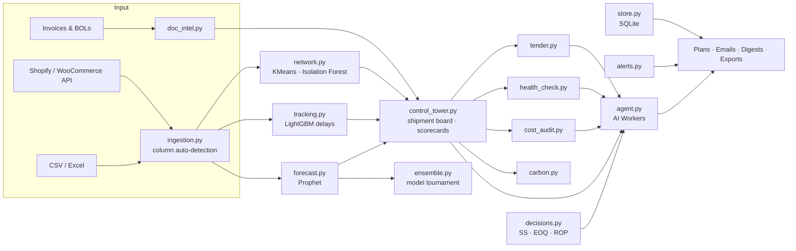
```mermaid
flowchart LR
    subgraph Input
        A[CSV / Excel] --> I
        B[Shopify / WooCommerce API] --> I
        C[Invoices & BOLs] --> DI
    end
    I[ingestion.py<br/>column auto-detection] --> F[forecast.py<br/>Prophet]
    I --> T[tracking.py<br/>LightGBM delays]
    I --> N[network.py<br/>KMeans · Isolation Forest]
    F & T & N --> CT[control_tower.py<br/>shipment board · scorecards]
    CT --> CA[cost_audit.py]
    CT --> HC[health_check.py]
    CT --> TE[tender.py]
    CT --> CB[carbon.py]
    DI[doc_intel.py] --> CT
    F --> EN[ensemble.py<br/>model tournament]
    D[decisions.py<br/>SS · EOQ · ROP] --> AG
    CT & CA & HC & TE --> AG[agent.py<br/>AI Workers]
    AG --> OUT[Plans · Emails · Digests · Exports]
    AL[alerts.py] & ST[store.py<br/>SQLite] --> OUT
```

### Repository layout

```
SupChainMate/
├── docs/
│   ├── DEMO.md                   # Guided five-minute demo walkthrough
│   ├── AUDIT.md                  # Enterprise readiness audit (8 dimensions)
│   ├── index.html                # Marketing landing page (GitHub Pages ready)
│   └── images/                   # README screenshots + animated demo
├── docker-compose.yml            # One-command full stack (postgres + backend + frontend)
├── .github/workflows/ci.yml      # CI: backend tests · frontend lint + build
├── design/                       # Design system + tokens (Tailwind/CSS) + prototypes
├── frontend/                     # React / Next.js control plane (App Router)
│   ├── app/                      #   screens (page.tsx per route) + login/
│   ├── auth/                     #   AuthProvider, RouteGuard, token store (isolated)
│   ├── components/               #   AppShell (role-gated nav), UI primitives, LaneMap
│   ├── lib/api.ts                #   Typed client (bearer + auto-refresh on 401)
│   └── Dockerfile                #   Multi-stage Next.js image
├── logistics-ai-dashboard/
│   ├── app.py                    # Streamlit entry point (dashboard orchestration)
│   ├── config.py                 # Paths, env lookup, model IDs, thresholds, logging
│   ├── Dockerfile                # FastAPI image
│   ├── api/                      # FastAPI layer (JSON over modules/ + ai/, additive)
│   │   ├── main.py               #   Endpoints + auth middleware gate + startup seed
│   │   ├── services.py           #   Compute/shape layer with graceful degradation
│   │   ├── connectors.py         #   Connectors & Integrations catalog (plug-in seam)
│   │   ├── workers.py            #   AI Digital Workers cockpit (roster from capabilities)
│   │   ├── fraud.py              #   Fraud & Anomaly Detection (duplicate/double-brokering/identity)
│   │   ├── documents.py          #   Invoice & Document Intelligence (three-way match)
│   │   ├── freight.py            #   Freight Operations (carrier vetting · matching · quoting · triage)
│   │   ├── risk_radar.py         #   Disruption & Risk Radar (signal convergence · risk index · layers)
│   │   ├── data_hub.py           #   Data Hub — data onboarding (parse · detect · map · validate · index)
│   │   ├── customers.py          #   Customer 360 — aggregator (reuses commercial_intel · Brain · RAG)
│   │   ├── agentic_ops.py        #   Agentic Ops Workflows (detect→diagnose→decide→execute→report)
│   │   ├── data_source.py        #   Centralized data-access layer (imported data ▸ else Olist demo)
│   │   ├── db.py                 #   SQLAlchemy engine (Postgres/SQLite via DATABASE_URL)
│   │   └── auth/                 #   JWT + RBAC (security, models, service, router, rbac)
│   ├── planner/                  # Executive decision orchestrator (registry/graph/executor)
│   ├── brain/                    # Decision Brain — long-term memory + vector store
│   ├── ai/                       # Provider-agnostic AI layer
│   │   ├── router.py             #   AI.ask() — the only capability→model resolver
│   │   ├── registry.py           #   Capability → ModelSpec plan
│   │   ├── types.py              #   Capability, ModelSpec, AIResponse (framework-free)
│   │   ├── rag.py · observability.py · cache.py   #   enterprise RAG, request log, response cache
│   │   ├── reasoning.py · embeddings.py · coding.py · safety.py · ocr.py · vision.py · memory.py
│   │   └── providers/nvidia.py   #   Cached NIM client, retries, timeouts
│   ├── optimize/                 # Pluggable optimization layer (beneath the agents)
│   │   ├── engine.py             #   OPT.solve() — problem kind → solver + fallback
│   │   ├── registry.py           #   ProblemKind → SolverSpec plan
│   │   ├── skills.py             #   Agent-facing skills (route, allocation)
│   │   └── solvers/              #   cuopt.py (NVIDIA cuOpt VRP) · local.py (NN+2-opt, transport)
│   ├── style.css                 # HUD theme
│   ├── requirements.txt          # Pinned dependency versions
│   ├── .env.example              # API key & SMTP template
│   ├── views/
│   │   ├── helpers.py            # Theme injection, chat render helpers
│   │   ├── landing.py            # Mode-select launch screen
│   │   ├── retail.py             # Small Retailer page
│   │   ├── upload.py             # Enterprise upload screen + store connect
│   │   ├── pipeline.py           # Demo loading & upload processing
│   │   ├── decision_center.py    # Human-in-the-loop approval workflow + audit
│   │   └── agents_hub.py         # Orchestrator UI: run workflows, per-agent reasoning
│   ├── modules/
│   │   ├── ingestion.py          # Column auto-detection, store-export recognition
│   │   ├── forecast.py           # Prophet + external regressors
│   │   ├── ensemble.py           # Model tournament (LightGBM/RF/GBM/Ridge vs Prophet)
│   │   ├── factors.py            # External factor engine (FX, oil, weather, holidays, analytics)
│   │   ├── tracking.py           # LightGBM delay model, feature engineering
│   │   ├── network.py            # Geolocation, KMeans, Isolation Forest, risk fusion
│   │   ├── decisions.py          # Decision engine (SS, EOQ, ROP, savings)
│   │   ├── sku.py                # Per-SKU intelligence: ABC classes, per-product engine
│   │   ├── control_tower.py      # Shipment board, carrier scorecards, KPIs
│   │   ├── cost_audit.py         # Billing anomaly detection
│   │   ├── doc_intel.py          # Invoice/BOL extraction + reconciliation
│   │   ├── carbon.py             # CO2e estimates by carrier, zone, mode
│   │   ├── health_check.py       # Scored 6-dimension assessment, DIFOT
│   │   ├── tender.py             # Tender/RFP pack + rate-shift simulation
│   │   ├── agent.py              # AI Workers: tool-calling loop + offline router + sweep
│   │   ├── trust.py              # Decision trust layer: explainable, scored recommendations
│   │   ├── agents/               # Multi-agent layer
│   │   │   ├── base.py           #   Agent contracts, scoped context, execution template
│   │   │   ├── domain.py         #   The 8 domain agents
│   │   │   └── orchestrator.py   #   Workflow engine + Decision Center routing
│   │   ├── runbook.py            # Plain-English standing rules engine
│   │   ├── groq_ai.py            # Groq copilot, auto-insights, column detection
│   │   ├── nvidia_api.py         # cuOpt VRP solver, DeepSeek fallback
│   │   ├── connect.py            # Shopify / WooCommerce connectors
│   │   ├── alerts.py             # Digests + SMTP delivery
│   │   ├── store.py              # SQLite persistence (tracker, settings, KPI history)
│   │   ├── retail.py             # Small Retailer helpers
│   │   └── optimization.py       # Network KPI summary
│   ├── tests/
│   │   ├── test_core.py          # Decision engine, forecasting, optimisation, network
│   │   └── test_modules.py       # Feature-module suite
│   └── data/                     # Demo dataset (Olist, 99k orders) + SQLite DB
├── CHANGELOG.md
└── README.md
```

---

## Getting Started

### Prerequisites

- Python 3.10+
- pip

### Installation

```bash
git clone https://github.com/Kisharky/SupChainMate.git
cd SupChainMate/logistics-ai-dashboard
pip install -r requirements.txt
```

### Run

```bash
streamlit run app.py          # or: python -m streamlit run app.py
```

Open http://localhost:8501, choose **Enterprise** or **Small Retailer** mode, and either upload data, connect a store, or press **Try Demo Data**.

---

## Configuration

All configuration is optional — **every feature degrades gracefully without it**. Copy the template and fill in what you use:

```bash
cp .env.example .env
```

| Variable | Purpose | Without it |
|---|---|---|
| `GROQ_API_KEY` | LLM reasoning for the AI Workers, auto-insights, executive narrative, invoice parsing, smart column detection | Deterministic routing and regex extraction still run every action |
| `NVIDIA_CUOPT_API_KEY` | Real cuOpt VRP route optimisation | Local greedy estimate, labelled as such |
| `NVIDIA_DEEPSEEK_API_KEY` | Copilot fallback when Groq is unavailable | Offline copilot mode |
| `NVIDIA_LLAMA_API_KEY` | Legacy fallback model | — |
| `SMTP_HOST` / `SMTP_PORT` / `SMTP_USER` / `SMTP_PASS` / `SMTP_FROM` | Email delivery of alert digests | Digests remain downloadable in-app |
| `MAPTILER_API_KEY` | Dark MapTiler basemap on the Leaflet radar | OpenStreetMap tiles (or plotly fallback) |
| `HERE_API_KEY` | Road matrices with live traffic | OSRM public server (keyless) |
| `OPENWEATHER_API_KEY` | Zone weather via OpenWeatherMap | Open-Meteo (keyless) |

**Store connections** (Shopify Admin API token with `read_orders`; WooCommerce read-only REST keys) are entered in the UI per-fetch and never persisted.

---

## Data Requirements

Upload any CSV or Excel — the ingestion engine auto-detects columns under any naming convention:

| Data type | Required | Auto-detected fields |
|---|---|---|
| **Orders** | ✅ | date/timestamp, quantity, SKU · Shopify & WooCommerce exports recognised |
| **Delivery** | Optional | delivery date, promised/ETA date, status, lead time, **carrier**, **freight cost**, transport mode |
| **Location** | Optional | lat/lon or postal code |
| **Cost** | Optional | cost / price / fee columns |

**Demo dataset**: [Olist Brazilian E-Commerce](https://www.kaggle.com/datasets/olistbr/brazilian-ecommerce) — 99,441 real orders with genuine promised-vs-actual delivery dates. Demo carrier names, freight costs, and transport modes are simulated and labelled in the UI.

---

## Testing

```bash
cd logistics-ai-dashboard
python -m pytest tests/ -q        # 119 tests
```

Coverage spans the decision-engine mathematics (safety stock, EOQ, ROP, monotonicity), network scoring (Haversine, clustering, Isolation Forest), forecasting aggregation, optimisation summaries, shipment classification, carrier scorecards, cost-audit anomaly detection, health-check scoring, tender and rate-shift math, ensemble backtesting, alert digests, SQLite persistence, agent routing and tracing, and the store connectors (exercised against mocked HTTP — no network required).

---

## Deployment

- **Streamlit Cloud / self-hosted** — point the deployment at `logistics-ai-dashboard/app.py`; add secrets from the configuration table above. Note that SQLite persistence is per-instance on ephemeral hosts.
- **Marketing site** — `docs/index.html` is a self-contained landing page: enable GitHub Pages on the `docs/` folder to publish it.

---

## Roadmap

- Real carrier tracking API integrations
- OAuth-based store connections and hosted multi-tenant deployment
- Scheduled background runs (workers acting between sessions, not just on load)

See [CHANGELOG.md](CHANGELOG.md) for the full release history (v1.0 → v4.8).

---

## Positioning

> While BI tools visualise, SupChainMate **decides** — generating prescriptive actions from multi-signal AI and exporting execution-ready plans directly into enterprise workflows.

| Dimension | Typical BI | SupChainMate |
|---|---|---|
| Output | Charts | Decisions, documents, alerts, exports |
| AI / ML | — | Prophet · LightGBM · Isolation Forest · ensemble tournament · Groq LLaMA-3.3 agents |
| Freight ops | — | Control tower, scorecards, cost audit, invoice scanner, tender packs, CO₂e |
| Integration | Data in | Data in **and** decisions out → Power BI / Excel / ERP |

---

## License

MIT © [Kishan Nagesh](https://www.linkedin.com/in/kisharky-n-5147941a4) — Master of Business (Supply Chain & International Business), Monash University, Melbourne
